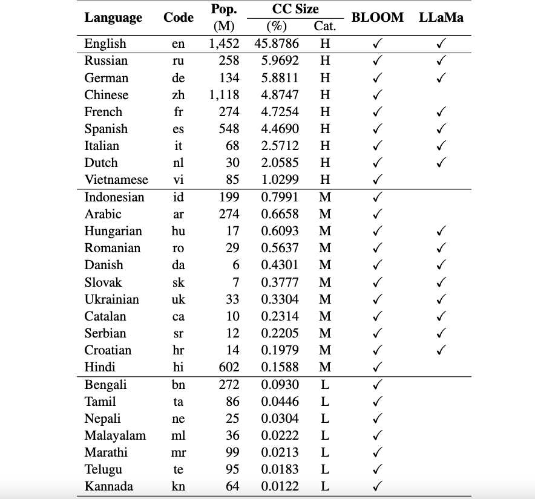

<h1 align="center"> <p> Okapi </p></h1>
<h3 align="center">
    <p>Instruction-tuned Large Language Models in Multiple Languages with Reinforcement Learning from Human Feedback</p>
</h3>

[](https://github.com/nlp-uoregon/Okapi/blob/main/LICENSE)
[](https://github.com/nlp-uoregon/Okapi/blob/main/DATA_LICENSE)

## Overview

This is the repo for the Okapi framework that introduces resources and models for instruction tuning for large language models (LLMs) with reinforcement learning from human feedback (RLHF) in multiple languages. Our framework supports 26 languages, including 8 high-resource languages, 11 medium-resource languages, and 7 low-resource languages.

<p align="center">

</p>

**Okapi Resources**: We provide resources to perform instruction tuning with RLHF for 26 languages, including ChatGPT prompts, multilingual instruction datasets, multilingual response ranking data, and multilingual evaluation benchmark datasets.

**Okapi Models**: We provide RLHF-based instruction-tuned LLMs for 26 languages on Okapi dataset. Our models include both BLOOM-based and LLaMa-based versions. We also provide scripts to interact with our models and fine-tune LLMs with our resources.

**Usage and License Notices**: Okapi is intended and licensed for research use only. The dataset is CC BY NC 4.0 (allowing only non-commercial use) and models trained using the dataset should not be used outside of research purposes.

Our technical paper with evaluation results can be found here: [here](https://arxiv.org/abs/2307.16039).

## Dataset Creation

We perform a comprehensive data collection process to prepare necessary data for our multilingual framework Okapi in four major steps:

1. **English Instruction Generation**: First, we obtain 52K English instructions for tuning LLMs from Alpaca. Afterward, we apply the same Self-Instruct procedure as Alpaca to generate 106K additional English instructions, resulting in a larger combined dataset of 158K instructions for our RLHF-based models in Okapi.
2. **Instruction Translation**: We utilize ChatGPT to translate our 158K English instructions into 26 target languages. For each language, the 158K instructions will be divided into data for supervised fine-tuning, reward modeling, and RLHF.
3. **Ranking Data Production**: We employ ChatGPT to rank multiple response outputs for the same instructions from LLMs. To produce response ranking data for multiple languages, we introduce a two-turn dialog approach: (i) instructions and responses are first translated into English, and (ii) ChatGPT then helps rank the translated data in English.
4. **Evaluation Data Creation**: We leverage three datasets in the HuggingFace Open LLM Leaderboard, i.e., AI2 Reasoning Challenge (ARC), HellaSwag, and MMLU, to evaluate the multilingual fine-tuned LLMs. As these datasets are originally provided for English only, we translate them into 26 languages in our framework using ChatGPT. The evaluation data and scripts can be found here: [here](https://github.com/laiviet/lm-evaluation-harness).

Our released data can be found in the **datasets** directory. It includes:

[`multilingual-alpaca-52k`](./datasets/multilingual-alpaca-52k): The translated data for 52K English instructions in Alpaca into 26 languages.

[`multilingual-ranking-data-42k`](./datasets/multilingual-ranking-data-42k): The multilingual response ranking data for 26 languages. For each language, we provide 42K instructions; each of them has 4 ranked responses. This data can be used to train reward models for 26 languages.

[`multilingual-rl-tuning-64k`](./datasets/multilingual-rl-tuning-64k): The multilingual instruction data for RLHF. We provide 62K instructions for each of the 26 languages.

## Model
Using our Okapi datasets and the RLHF-based instruction-tuning technique, we introduce multilingual fine-tuned LLMs for 26 languages, built upon the 7B versions of LLaMA and BLOOM. The models can be obtained from HuggingFace [here](https://huggingface.co/uonlp). 


## Chat with our Models
Okapi supports interactive chats with the multilingual instruction-tuned LLMs in 26 languages. Following the following steps for the chats:

1. Clone our repository
```
git clone https://github.com/nlp-uoregon/Okapi.git
cd Okapi
pip install -r requirements.txt
```

2. Select a model for a language and chat with it. For each of the 26 languages, both BLOOM-based and LLaMa-based models can be selected. The full list of the models can be found [here](https://huggingface.co/uonlp).
```python
from chat import pipeline

model_path = 'uonlp/okapi-vi-bloom'
p = pipeline(model_path, gpu=True)

instruction = 'Dịch câu sau sang Tiếng Việt' # Translate the following sentence into Vietnamese
prompt_input = 'The City of Eugene - a great city for the arts and outdoors. '

response = p.generate(instruction=instruction, prompt_input=prompt_input)
print(response)
```
## Training
We also provide scripts to fine-tune LLMs with our instruction data using RLHF, covering three major steps: supervised fine-tuning, reward modeling, and fine-tuning with RLHF. Use the following steps to fine-tune LLMs:

### Set up the environment:
```bash
conda create -n okapi python=3.9
conda activate okapi
pip install -r requirements.txt
```

### Training with multiple GPUs:

1. Supervised Fine-tuning
```bash
bash scripts/supervised_finetuning.sh [LANG]
```

2. Reward Modeling
```bash
bash scripts/reward_modeling.sh [LANG]
```

3. Fine-tuning with RLHF
```bash
bash scripts/rl_training.sh [LANG]
```

## Citation
If you use the data, model or code in this repository, please cite:

```
@article{dac2023okapi,
  title={Okapi: Instruction-tuned Large Language Models in Multiple Languages with Reinforcement Learning from Human Feedback},
  author={Dac Lai, Viet and Van Nguyen, Chien and Ngo, Nghia Trung and Nguyen, Thuat and Dernoncourt, Franck and Rossi, Ryan A and Nguyen, Thien Huu},
  journal={arXiv e-prints},
  pages={arXiv--2307},
  year={2023}
}
```
